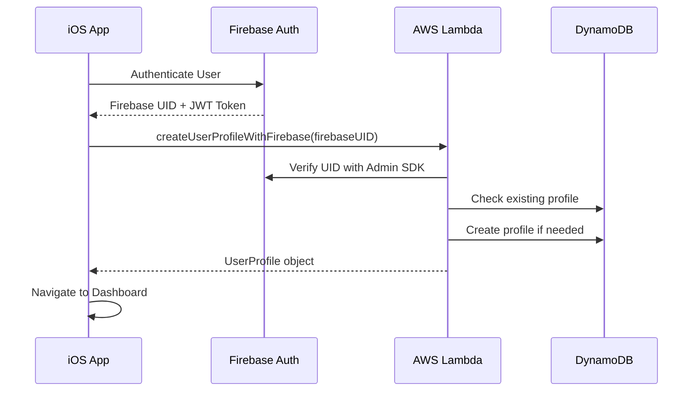
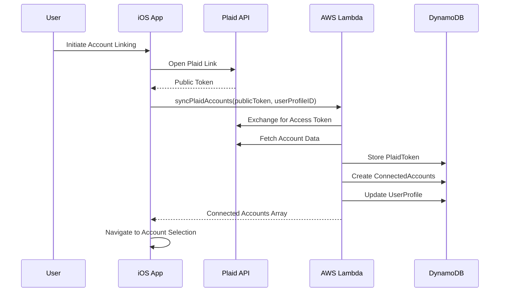
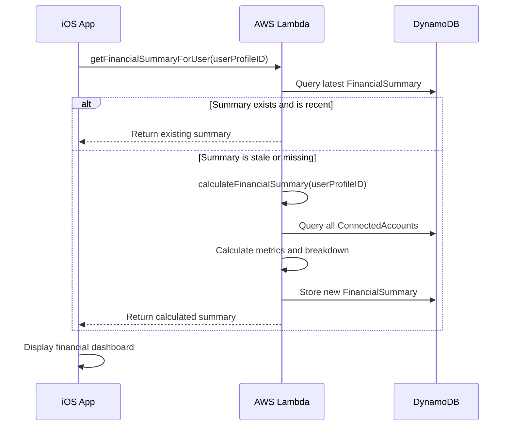
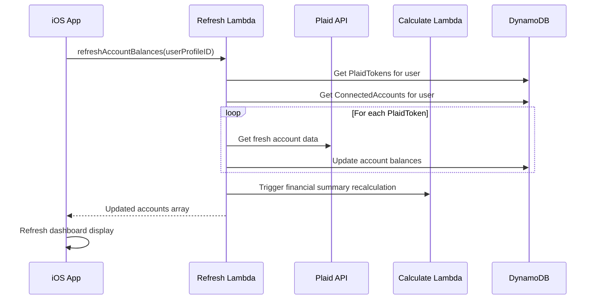

# Yori - AI-Driven Financial Planning App


*AI-driven financial planning, made simple*

## 📋 Table of Contents

- [Overview](#overview)
- [Architecture](#architecture)
- [Tech Stack](#tech-stack)
- [iOS Application](#ios-application)
- [Backend Services](#backend-services)
- [GraphQL API](#graphql-api)
- [Database Schema](#database-schema)
- [Authentication Flow](#authentication-flow)
- [Financial Data Flow](#financial-data-flow)
- [Setup & Deployment](#setup--deployment)
- [API Reference](#api-reference)

---

## 📱 Overview

Yori is a comprehensive financial planning iOS application that helps users track their financial health through AI-powered insights and recommendations. The app integrates with Plaid for secure bank account linking and provides real-time financial summaries, net worth tracking, and asset categorization.

### Key Features

- **🔐 Multi-Factor Authentication**: Firebase Auth with Email, Google, Apple Sign-In, Phone, and Face ID/Touch ID
- **🏦 Bank Integration**: Secure Plaid integration for automatic account linking
- **📊 Financial Dashboard**: Real-time net worth, asset breakdown, and financial summaries
- **☁️ Hybrid Backend**: Firebase Authentication + AWS Amplify backend for scalability
- **🔄 Real-Time Sync**: Automatic balance updates and financial recalculation
- **🎯 Asset Categorization**: Intelligent grouping of accounts by type (Cash, Investments, Real Estate, etc.)

---

## 🏗️ Architecture

```
┌─────────────────┐    ┌──────────────────┐    ┌─────────────────┐
│   iOS App       │    │   Firebase Auth  │    │  AWS Amplify    │
│   (SwiftUI)     │◄──►│                  │◄──►│   Backend       │
│                 │    │  - Email/Phone   │    │                 │
│  - Dashboard    │    │  - Google        │    │  - GraphQL API  │
│  - Accounts     │    │  - Apple         │    │  - Lambda Funcs │
│  - Settings     │    │  - Biometrics    │    │  - DynamoDB     │
│  - Onboarding   │    │                  │    │                 │
└─────────────────┘    └──────────────────┘    └─────────────────┘
          │                                              │
          │            ┌──────────────────┐             │
          └───────────►│   Plaid API      │◄────────────┘
                       │                  │
                       │  - Bank Linking  │
                       │  - Account Data  │
                       │  - Balance Sync  │
                       └──────────────────┘
```

### Hybrid Authentication Architecture

Yori uses a hybrid authentication system combining Firebase's robust authentication with AWS Amplify's scalable backend:

1. **Frontend Authentication**: Firebase handles all user authentication (login, registration, MFA)
2. **Backend Authorization**: Firebase JWT tokens are validated by AWS Lambda functions
3. **User Profiles**: User data stored in DynamoDB, linked by Firebase UID
4. **Session Management**: Firebase manages sessions, AWS handles business logic

---

## 🛠️ Tech Stack

### iOS Application
- **SwiftUI**: Modern declarative UI framework
- **Firebase Auth**: Authentication and user management
- **AWS Amplify iOS SDK**: Backend API integration
- **LocalAuthentication**: Face ID/Touch ID biometric authentication

### Backend Services
- **AWS Amplify**: Backend framework and GraphQL API
- **AWS Lambda**: Serverless compute functions (Node.js 18.x)
- **Amazon DynamoDB**: NoSQL database with global secondary indexes
- **AWS Systems Manager**: Secure parameter store for secrets
- **Firebase Admin SDK**: Server-side Firebase integration

### External APIs
- **Plaid API**: Bank account linking and financial data
- **Firebase Authentication**: Multi-provider authentication service

---

## 📱 iOS Application

### Application Structure

```
yori/
├── yoriApp.swift              # App entry point and configuration
├── AuthenticationView.swift   # Complete authentication flow
├── OnboardingWelcomeView.swift # Swipeable onboarding introduction
├── PlaidConnectionView.swift  # Bank account linking via Plaid
├── AccountSelectionView.swift # Account selection after Plaid Link
├── DashboardView.swift        # Main financial dashboard
├── DashboardCards.swift       # Reusable dashboard components
├── AccountsView.swift         # Account management interface
├── SettingsView.swift         # App settings and user preferences
├── AmplifyAPIService.swift    # Backend API integration service
├── FinancialData.swift        # Data models and business logic
└── Assets.xcassets/           # App icons, images, and assets
```

### Key View Controllers

#### `AuthenticationView.swift`
The primary authentication interface supporting multiple authentication methods:

**Key Methods:**
- `signInWithEmail()` - Email/password authentication
- `signInWithGoogle()` - Google OAuth integration
- `signInWithApple()` - Apple Sign-In with credential handling
- `signInWithPhone()` - SMS-based phone authentication
- `authenticateWithBiometrics()` - Face ID/Touch ID authentication
- `sendPhoneVerification()` - Initiates SMS verification flow
- `verifyPhoneCode()` - Validates SMS verification code

**Features:**
- Auto-fill support for emails and phone numbers
- Persistent biometric authentication settings
- Phone number verification with UserDefaults persistence
- Keyboard dismissal with tap gestures
- Loading states and error handling

#### `DashboardView.swift`
The main financial overview interface displaying user's financial health:

**Key Methods:**
- `loadFinancialData()` - Fetches financial summary from backend
- `loadMockData()` - Fallback mock data for development
- `calculateAssetBreakdown()` - Categorizes assets by type
- `signOut()` - Handles user logout and onboarding reset

**Components Displayed:**
- `NetWorthCard` - Net worth with percentage change
- `AssetsLiabilitiesCard` - Total assets vs liabilities
- `AssetBreakdownCard` - Categorized asset distribution
- `QuickActionsCard` - Navigation shortcuts

#### `AccountsView.swift`
Account management interface for linked bank accounts:

**Key Methods:**
- `loadConnectedAccounts()` - Fetches user's connected accounts
- `disconnectAccount()` - Removes account connection
- `loadMockAccounts()` - Development fallback data

**Account Management Features:**
- Account balance display with formatting
- Institution and account type categorization
- Account status indicators (active/inactive)
- Disconnect confirmation dialogs
- Add new account linking

#### `PlaidConnectionView.swift`
Plaid Link integration for secure bank account connection:

**Key Methods:**
- `connectWithPlaid()` - Initiates Plaid Link flow (currently simulated)
- `sendTokenToBackend()` - Exchanges Plaid public token for access token

**Plaid Integration Flow:**
1. User initiates connection
2. Plaid Link modal (to be implemented)
3. Public token exchange
4. Account data retrieval
5. Account selection interface

### Data Service Layer

#### `AmplifyAPIService.swift`
The primary backend integration service handling all API communications:

**User Profile Management:**
- `getCurrentUserProfile()` - Retrieves or creates user profile
- `createUserProfile()` - Creates new user profile with Firebase UID
- `updateUserProfile()` - Updates user profile information

**Connected Accounts:**
- `getConnectedAccounts()` - Fetches user's linked bank accounts
- `syncPlaidAccounts()` - Syncs Plaid accounts after Link flow
- `disconnectAccount()` - Removes account connection

**Financial Data:**
- `getFinancialSummary()` - Retrieves latest financial calculations
- `calculateFinancialSummary()` - Triggers new financial summary calculation

**GraphQL Integration:**
- Pre-defined GraphQL queries and mutations
- Type-safe request/response handling
- Error handling and transformation
- Firebase token integration

### Data Models

#### `UserProfile`
```swift
struct UserProfile {
    let id: String              # Firebase UID (primary key)
    let firebaseUID: String     # Firebase user identifier
    let email: String?          # User email address
    let displayName: String?    # User display name
    var onboardingCompleted: Bool
    var hasConnectedAccounts: Bool
    let preferredCurrency: String?
    let createdAt: Date?
    let updatedAt: Date?
}
```

#### `ConnectedAccount`
```swift
struct ConnectedAccount {
    let id: String              # Account UUID
    let userProfileID: String?  # Reference to UserProfile
    let accountName: String     # Display name (e.g., "Chase Checking")
    let accountType: String     # Account type (CHECKING, SAVINGS, etc.)
    let balance: Double         # Current account balance
    let institution: String     # Bank/institution name
    let plaidAccountID: String? # Plaid account identifier
    let isActive: Bool         # Account status
    let lastSynced: Date?      # Last balance update
}
```

#### `FinancialSummary`
```swift
struct FinancialSummary {
    let id: String?
    let netWorth: Double              # Total assets - liabilities
    let totalAssets: Double           # Sum of all positive balances
    let totalLiabilities: Double      # Sum of all negative balances
    let netWorthChangePercent: Double? # Month-over-month change
    let assetBreakdown: [AssetCategory] # Categorized asset distribution
    let calculatedAt: Date?           # Calculation timestamp
}
```

---

## ⚡ Backend Services

### AWS Lambda Functions

The backend consists of 7 specialized Lambda functions handling different aspects of the application:

#### 1. `createUserProfileWithFirebase`
**Purpose**: Creates user profiles with Firebase UID verification

**Key Features:**
- Firebase UID validation using Firebase Admin SDK
- Secure SSM parameter retrieval for Firebase credentials
- Duplicate profile prevention
- DynamoDB integration

**Input Parameters:**
- `firebaseUID` (String!) - Firebase user identifier
- `email` (String) - User email address
- `displayName` (String) - User display name

**Process Flow:**
1. Retrieve Firebase private key from AWS SSM
2. Initialize Firebase Admin SDK
3. Verify Firebase UID exists and is valid
4. Check for existing user profile in DynamoDB
5. Create new UserProfile record if none exists
6. Return created or existing profile

**Dependencies:**
- `@aws-sdk/client-dynamodb` - DynamoDB operations
- `@aws-sdk/client-ssm` - Secure parameter retrieval
- `firebase-admin` - Firebase server-side operations

#### 2. `getUserProfileByFirebaseUID`
**Purpose**: Efficient user profile lookup using Firebase UID

**Key Features:**
- GSI query optimization on `byFirebaseUID` index
- Fast user authentication lookups
- Null handling for non-existent users

**Input Parameters:**
- `firebaseUID` (String!) - Firebase user identifier

**Process Flow:**
1. Query DynamoDB using GSI on firebaseUID
2. Return first matching profile or null
3. Log lookup results for debugging

**Dependencies:**
- `@aws-sdk/client-dynamodb` - DynamoDB operations
- `@aws-sdk/lib-dynamodb` - Document client for queries

#### 3. `syncPlaidAccounts`
**Purpose**: Handles Plaid Link token exchange and account synchronization

**Key Features:**
- Plaid public token to access token exchange
- Institution name resolution
- Multiple account type mapping
- Secure token storage with encryption support
- User profile update after successful sync

**Input Parameters:**
- `publicToken` (String!) - Plaid Link public token
- `userProfileID` (ID!) - User profile identifier

**Process Flow:**
1. Initialize Plaid client with credentials from SSM
2. Exchange public token for access token
3. Retrieve account information from Plaid
4. Fetch institution details for display names
5. Store PlaidToken record in DynamoDB
6. Create ConnectedAccount records for each account
7. Update UserProfile hasConnectedAccounts flag
8. Return array of created accounts

**Account Type Mapping:**
- `checking` → `CHECKING`
- `savings` → `SAVINGS`
- `credit card` → `CREDIT_CARD`
- `investment` → `INVESTMENT`
- `401k`, `ira` → `RETIREMENT`
- `mortgage` → `MORTGAGE`
- `loan` → `LOAN`

**Dependencies:**
- `plaid` - Plaid API SDK
- `@aws-sdk/client-ssm` - Secure parameter retrieval
- `@aws-sdk/lib-dynamodb` - DynamoDB operations
- `uuid` - Unique identifier generation

#### 4. `calculateFinancialSummary`
**Purpose**: Generates comprehensive financial overview and asset breakdown

**Key Features:**
- Asset vs liability categorization
- Historical net worth change calculation
- Dynamic asset breakdown by category
- Percentage calculations for asset distribution

**Input Parameters:**
- `userProfileID` (ID!) - User profile identifier

**Process Flow:**
1. Query all active ConnectedAccounts for user
2. Separate assets (positive balance) from liabilities (negative balance)
3. Calculate total assets, liabilities, and net worth
4. Generate asset breakdown by category with percentages
5. Retrieve previous financial summaries for change calculation
6. Create new FinancialSummary record
7. Return calculated summary with parsed asset breakdown

**Asset Categories:**
- **Cash & Savings**: Checking and savings accounts (blue)
- **Investments**: Investment and brokerage accounts (green)
- **Retirement**: 401k, IRA, and retirement accounts (purple)
- **Real Estate**: Mortgage and property accounts (orange)
- **Other Assets**: All other asset types (gray)

**Dependencies:**
- `@aws-sdk/lib-dynamodb` - DynamoDB operations
- `uuid` - Unique identifier generation

#### 5. `refreshAccountBalances`
**Purpose**: Updates account balances via Plaid API and triggers recalculation

**Key Features:**
- Bulk balance refresh for all user accounts
- Plaid error handling and token deactivation
- Automatic financial summary recalculation
- Lambda function chaining

**Input Parameters:**
- `userProfileID` (ID!) - User profile identifier

**Process Flow:**
1. Retrieve all active PlaidTokens for user
2. Query connected accounts grouped by Plaid item
3. For each Plaid token:
   - Fetch fresh account data from Plaid
   - Update balances in DynamoDB if changed
   - Handle Plaid API errors gracefully
   - Deactivate tokens for invalid items
4. Trigger `calculateFinancialSummary` function asynchronously
5. Return updated account list

**Error Handling:**
- `ITEM_LOGIN_REQUIRED` - Deactivates token, requires re-authentication
- `ACCESS_NOT_GRANTED` - Deactivates token, permission revoked
- Network errors - Logged but don't affect other accounts

**Dependencies:**
- `plaid` - Plaid API SDK
- `@aws-sdk/client-lambda` - Lambda function invocation
- `@aws-sdk/lib-dynamodb` - DynamoDB operations

#### 6. `getFinancialSummaryForUser`
**Purpose**: Retrieves the latest financial summary for dashboard display

**Key Features:**
- Most recent summary retrieval
- JSON parsing for asset breakdown
- Optimized query with sort order

**Input Parameters:**
- `userProfileID` (ID!) - User profile identifier

**Process Flow:**
1. Query FinancialSummary table using GSI
2. Sort by creation date descending (most recent first)
3. Parse assetBreakdown JSON string to array
4. Return latest summary or null if none exists

**Dependencies:**
- `@aws-sdk/lib-dynamodb` - DynamoDB operations

#### 7. `getActiveConnectedAccounts`
**Purpose**: Retrieves all active connected accounts for account management

**Key Features:**
- Active account filtering
- User-specific account retrieval
- Account status validation

**Input Parameters:**
- `userProfileID` (ID!) - User profile identifier

**Process Flow:**
1. Query ConnectedAccount table using GSI
2. Filter for active accounts only
3. Return account list for display

**Dependencies:**
- `@aws-sdk/lib-dynamodb` - DynamoDB operations

### Environment Variables & Security

**Firebase Configuration:**
- `FIREBASE_PROJECT_ID` - Firebase project identifier
- `FIREBASE_CLIENT_EMAIL` - Service account email
- `FIREBASE_PRIVATE_KEY` - Private key (stored in SSM)

**Plaid Configuration:**
- `PLAID_CLIENT_ID` - Plaid application client ID
- `PLAID_SECRET` - Plaid secret key (stored in SSM)
- `PLAID_ENV` - Environment (sandbox/development/production)

**AWS Resources:**
- `API_YORI_*TABLE_NAME` - DynamoDB table names (auto-generated)
- `REGION` - AWS region
- `ENV` - Environment name

---

## 🔗 GraphQL API

### Schema Overview

The GraphQL API provides a unified interface for all backend operations with proper authorization and type safety.

#### Core Types

**UserProfile**
```graphql
type UserProfile @model @auth(rules: [{ allow: private }]) {
  id: ID!
  firebaseUID: String! @index(name: "byFirebaseUID")
  email: String
  displayName: String
  onboardingCompleted: Boolean!
  hasConnectedAccounts: Boolean!
  preferredCurrency: String
  createdAt: AWSDateTime!
  updatedAt: AWSDateTime!

  # Relationships
  connectedAccounts: [ConnectedAccount] @hasMany(indexName: "byUserProfile", fields: ["id"])
  financialSummaries: [FinancialSummary] @hasMany(indexName: "byUserProfile", fields: ["id"])
  plaidTokens: [PlaidToken] @hasMany(indexName: "byUserProfile", fields: ["id"])
}
```

**ConnectedAccount**
```graphql
type ConnectedAccount @model @auth(rules: [{ allow: private }]) {
  id: ID!
  userProfileID: ID! @index(name: "byUserProfile")
  accountName: String!
  accountType: AccountType!
  balance: Float!
  institution: String!
  plaidAccountID: String
  plaidItemID: String
  isActive: Boolean!
  lastSynced: AWSDateTime
  createdAt: AWSDateTime!
  updatedAt: AWSDateTime!
}
```

**FinancialSummary**
```graphql
type FinancialSummary @model @auth(rules: [{ allow: private }]) {
  id: ID!
  userProfileID: ID! @index(name: "byUserProfile")
  netWorth: Float!
  totalAssets: Float!
  totalLiabilities: Float!
  netWorthChangePercent: Float
  assetBreakdown: AWSJSON
  calculatedAt: AWSDateTime!
  createdAt: AWSDateTime!
  updatedAt: AWSDateTime!
}
```

#### Custom Mutations

**User Management:**
```graphql
createUserProfileWithFirebase(firebaseUID: String!, email: String, displayName: String): UserProfile
```

**Financial Operations:**
```graphql
syncPlaidAccounts(publicToken: String!, userProfileID: ID!): [ConnectedAccount]
calculateFinancialSummary(userProfileID: ID!): FinancialSummary
refreshAccountBalances(userProfileID: ID!): [ConnectedAccount]
```

#### Custom Queries

**Data Retrieval:**
```graphql
getUserProfileByFirebaseUID(firebaseUID: String!): UserProfile
getFinancialSummaryForUser(userProfileID: ID!): FinancialSummary
getActiveConnectedAccounts(userProfileID: ID!): [ConnectedAccount]
```

---

## 🗄️ Database Schema

### DynamoDB Tables

#### UserProfile Table
- **Primary Key**: `id` (Firebase UID)
- **GSI**: `byFirebaseUID` - Enables efficient Firebase UID lookups
- **Attributes**: User profile information, preferences, and status flags

#### ConnectedAccount Table
- **Primary Key**: `id` (UUID)
- **GSI**: `byUserProfile` - Enables user-specific account queries
- **Attributes**: Account details, balances, Plaid integration data

#### PlaidToken Table
- **Primary Key**: `id` (UUID)
- **GSI**: `byUserProfile` - Enables user-specific token management
- **Attributes**: Plaid access tokens, institution data, status information

#### FinancialSummary Table
- **Primary Key**: `id` (UUID)
- **GSI**: `byUserProfile` - Enables user-specific financial history
- **Attributes**: Calculated financial metrics, asset breakdowns, timestamps

### Data Relationships

```
UserProfile (1) ──────┐
                      │
                      ├─── ConnectedAccount (n)
                      │
                      ├─── PlaidToken (n)
                      │
                      └─── FinancialSummary (n)
```

---

## 🔐 Authentication Flow

### User Registration/Login Flow



### Authentication Methods Supported

1. **Email/Password**: Traditional email and password authentication
2. **Google Sign-In**: OAuth 2.0 with Google services
3. **Apple Sign-In**: Apple's native authentication service
4. **Phone Authentication**: SMS-based verification with international support
5. **Biometric Authentication**: Face ID/Touch ID for returning users

### Session Management

- **Firebase**: Handles session persistence and token refresh
- **iOS**: Stores biometric authentication preferences
- **Backend**: Validates Firebase JWT tokens for each API request

---

## 💰 Financial Data Flow

### Account Linking Flow



### Financial Calculation Flow



### Balance Refresh Flow



---

## 🚀 Setup & Deployment

### Prerequisites

- **iOS Development**: Xcode 14+, iOS 15+ target
- **Node.js**: Version 18.x for Lambda functions
- **AWS CLI**: Configured with appropriate permissions
- **Amplify CLI**: `npm install -g @aws-amplify/cli`
- **Firebase Project**: Set up with Authentication enabled
- **Plaid Account**: Developer account with API keys

### Environment Setup

#### 1. Firebase Configuration

1. Create Firebase project at [Firebase Console](https://console.firebase.google.com)
2. Enable Authentication with desired providers
3. Download `GoogleService-Info.plist` to iOS project
4. Generate service account key for server-side operations

#### 2. Plaid Configuration

1. Sign up at [Plaid Dashboard](https://dashboard.plaid.com)
2. Create application and obtain:
   - Client ID
   - Secret keys (sandbox, development, production)
3. Configure allowed redirect URIs

#### 3. AWS Amplify Setup

```bash
# Initialize Amplify project
cd yori
amplify init

# Add GraphQL API
amplify add api
# Choose GraphQL
# Use existing schema: amplify/backend/api/yori/schema.graphql

# Add Lambda functions (if not already added)
amplify add function
# Choose existing functions from amplify/backend/function/

# Configure environment variables and secrets
amplify update function
# Add environment variables for each function

# Deploy backend
amplify push
```

#### 4. Environment Variables Configuration

For each Lambda function, configure:

```bash
# Firebase credentials
FIREBASE_PROJECT_ID=your-project-id
FIREBASE_CLIENT_EMAIL=your-service-account@project.iam.gserviceaccount.com

# Plaid credentials
PLAID_CLIENT_ID=your-plaid-client-id
PLAID_ENV=sandbox  # or development/production

# Secrets (stored in AWS SSM)
FIREBASE_PRIVATE_KEY=/amplify/yori/function/firebase-private-key
PLAID_SECRET=/amplify/yori/function/plaid-secret
```

### iOS App Configuration

#### 1. Dependencies Installation

The project uses Swift Package Manager for dependencies. Required packages:
- Firebase iOS SDK
- AWS Amplify iOS
- Amplify API/DataStore

#### 2. Configuration Files

**Info.plist Updates:**
```xml
<!-- Firebase -->
<key>GoogleService-Info</key>
<string>GoogleService-Info.plist</string>

<!-- URL Schemes for OAuth -->
<key>CFBundleURLTypes</key>
<array>
    <dict>
        <key>CFBundleURLName</key>
        <string>com.googleusercontent.apps.YOUR_CLIENT_ID</string>
        <key>CFBundleURLSchemes</key>
        <array>
            <string>YOUR_REVERSED_CLIENT_ID</string>
        </array>
    </dict>
</array>

<!-- Biometric Authentication -->
<key>NSFaceIDUsageDescription</key>
<string>Use Face ID to securely access your financial data</string>
```

**Entitlements:**
- App Groups (if needed)
- Associated Domains
- Sign in with Apple capability

### Deployment Process

#### Backend Deployment

```bash
# Deploy all backend resources
amplify push

# Deploy specific functions
amplify push function

# Check deployment status
amplify status

# View function logs
amplify function logs <function-name>
```

#### iOS App Deployment

1. **Development Testing**:
   - Use iOS Simulator for initial testing
   - Test on physical device for biometric features
   - Use Plaid sandbox environment

2. **TestFlight Distribution**:
   - Archive and upload to App Store Connect
   - Configure beta testing groups
   - Test production integrations

3. **App Store Release**:
   - Submit for App Store review
   - Configure production Plaid environment
   - Monitor production Lambda functions

### Testing Strategy

#### Unit Testing
- Model validation
- API service methods
- Business logic calculations

#### Integration Testing
- Firebase authentication flows
- Plaid Link integration
- Backend API responses

#### End-to-End Testing
- Complete user registration flow
- Account linking and data sync
- Financial calculation accuracy

---

## 📚 API Reference

### iOS API Service Methods

#### User Profile Management

```swift
// Get current user profile, create if needed
func getCurrentUserProfile() async throws -> UserProfile

// Create new user profile
func createUserProfile(firebaseUID: String, email: String?, displayName: String?) async throws -> UserProfile

// Update existing user profile
func updateUserProfile(_ userProfile: UserProfile) async throws -> UserProfile
```

#### Account Management

```swift
// Get all connected accounts for user
func getConnectedAccounts() async throws -> [ConnectedAccount]

// Sync accounts after Plaid Link
func syncPlaidAccounts(publicToken: String) async throws -> [ConnectedAccount]

// Remove account connection
func disconnectAccount(_ accountId: String) async throws
```

#### Financial Data

```swift
// Get latest financial summary
func getFinancialSummary() async throws -> FinancialSummary

// Trigger new financial calculation
private func calculateFinancialSummary(for userProfileID: String) async throws -> FinancialSummary
```

### GraphQL Operations

#### Queries

```graphql
# Get user by Firebase UID
query GetUserProfileByFirebaseUID($firebaseUID: String!) {
  getUserProfileByFirebaseUID(firebaseUID: $firebaseUID) {
    id
    firebaseUID
    email
    displayName
    onboardingCompleted
    hasConnectedAccounts
    preferredCurrency
    createdAt
    updatedAt
  }
}

# Get financial summary
query GetFinancialSummary($userProfileID: ID!) {
  getFinancialSummaryForUser(userProfileID: $userProfileID) {
    id
    netWorth
    totalAssets
    totalLiabilities
    netWorthChangePercent
    assetBreakdown
    calculatedAt
    createdAt
    updatedAt
  }
}

# Get active accounts
query GetActiveConnectedAccounts($userProfileID: ID!) {
  getActiveConnectedAccounts(userProfileID: $userProfileID) {
    id
    accountName
    accountType
    balance
    institution
    isActive
    lastSynced
    createdAt
    updatedAt
  }
}
```

#### Mutations

```graphql
# Create user profile
mutation CreateUserProfile($firebaseUID: String!, $email: String, $displayName: String) {
  createUserProfileWithFirebase(firebaseUID: $firebaseUID, email: $email, displayName: $displayName) {
    id
    firebaseUID
    email
    displayName
    onboardingCompleted
    hasConnectedAccounts
    preferredCurrency
    createdAt
    updatedAt
  }
}

# Sync Plaid accounts
mutation SyncPlaidAccounts($publicToken: String!, $userProfileID: ID!) {
  syncPlaidAccounts(publicToken: $publicToken, userProfileID: $userProfileID) {
    id
    accountName
    accountType
    balance
    institution
    isActive
    createdAt
  }
}

# Calculate financial summary
mutation CalculateFinancialSummary($userProfileID: ID!) {
  calculateFinancialSummary(userProfileID: $userProfileID) {
    id
    netWorth
    totalAssets
    totalLiabilities
    netWorthChangePercent
    assetBreakdown
    calculatedAt
    createdAt
    updatedAt
  }
}

# Refresh account balances
mutation RefreshAccountBalances($userProfileID: ID!) {
  refreshAccountBalances(userProfileID: $userProfileID) {
    id
    accountName
    accountType
    balance
    institution
    lastSynced
    updatedAt
  }
}
```

### Lambda Function APIs

Each Lambda function accepts GraphQL resolver events with the following structure:

```javascript
{
  "arguments": {
    // Function-specific parameters
  },
  "identity": {
    "claims": {
      // Firebase JWT claims (if applicable)
    }
  },
  "source": {
    // Parent object (for nested resolvers)
  }
}
```

### Error Handling

#### API Error Types

```swift
enum APIError: Error {
    case notAuthenticated
    case amplifyError(GraphQLError)
    case decodingError(Error)
    case networkError(Error)
}
```

#### Lambda Error Responses

```javascript
// Standard error response format
{
  "errorMessage": "Descriptive error message",
  "errorType": "ErrorType",
  "stackTrace": ["..."]
}
```

### Rate Limits & Quotas

#### Plaid API Limits
- Sandbox: No limits
- Development: 100 requests/minute
- Production: Custom limits based on plan

#### AWS Lambda Limits
- Concurrent executions: 1000 (default)
- Function timeout: 15 minutes (configured to 2 minutes)
- Memory: 128MB to 10GB (configured per function)

#### DynamoDB Limits
- On-demand billing: No pre-defined limits
- Auto-scaling enabled for read/write capacity
- Global secondary indexes: 20 per table

---

## 🔧 Troubleshooting

### Common Issues

#### Firebase Authentication
- **Issue**: Google Sign-In not working
- **Solution**: Verify URL schemes in Info.plist match Firebase configuration

#### Plaid Integration
- **Issue**: "Invalid public token" error
- **Solution**: Ensure Plaid environment matches between frontend and backend

#### Lambda Function Errors
- **Issue**: "Firebase private key not found"
- **Solution**: Verify SSM parameter is correctly configured and accessible

#### DynamoDB Issues
- **Issue**: "User profile not found"
- **Solution**: Check GSI configuration on byFirebaseUID index

### Debugging Tools

- **Xcode Console**: iOS app debugging and logging
- **AWS CloudWatch**: Lambda function logs and metrics
- **Amplify CLI**: Backend status and deployment logs
- **Firebase Console**: Authentication debugging and user management
- **Plaid Dashboard**: API request logs and error details

---

## 📈 Performance Optimization

### iOS App Optimizations
- SwiftUI view caching for dashboard components
- Lazy loading for account lists
- Image asset optimization
- Network request caching

### Backend Optimizations
- DynamoDB GSI design for efficient queries
- Lambda cold start mitigation with provisioned concurrency
- Plaid API request batching for multiple accounts
- Financial calculation caching to reduce redundant processing

### Monitoring & Analytics
- AWS CloudWatch for Lambda metrics
- Firebase Analytics for user behavior
- Custom metrics for financial calculation performance
- Plaid webhook integration for real-time updates

---

## 🛡️ Security Considerations

### Data Protection
- Firebase JWT token validation in all Lambda functions
- Encrypted storage of Plaid access tokens (recommended for production)
- Personal data encryption in DynamoDB
- Secure transmission with HTTPS/TLS

### Authentication Security
- Multi-factor authentication support
- Biometric authentication for sensitive operations
- Session timeout and token refresh
- Account lockout after failed attempts

### API Security
- GraphQL query depth limiting
- Rate limiting on API endpoints
- Input validation and sanitization
- SQL injection prevention (NoSQL)

### Compliance
- GDPR compliance for EU users
- PCI DSS compliance for financial data
- SOC 2 compliance through AWS services
- Regular security audits and penetration testing

---

## 🤝 Contributing

### Development Workflow

1. **Feature Branch**: Create feature branches from `main`
2. **Code Review**: All changes require review before merge
3. **Testing**: Unit and integration tests required
4. **Deployment**: Staging environment testing before production

### Code Standards

- **Swift**: Follow Swift API Design Guidelines
- **JavaScript**: ESLint configuration for Lambda functions
- **GraphQL**: Use descriptive names and proper documentation
- **Git**: Conventional Commits specification

### Documentation

- Update README for major changes
- Document new API endpoints
- Maintain inline code comments
- Update GraphQL schema documentation

---

## 📄 License

This project is proprietary software. All rights reserved.

---

## 📞 Support

For technical support or questions:
- Create issues in the project repository
- Contact the development team
- Refer to AWS Amplify documentation
- Check Firebase documentation for authentication issues

---

*Last updated: November 2, 2024*
*Version: 1.0.0*